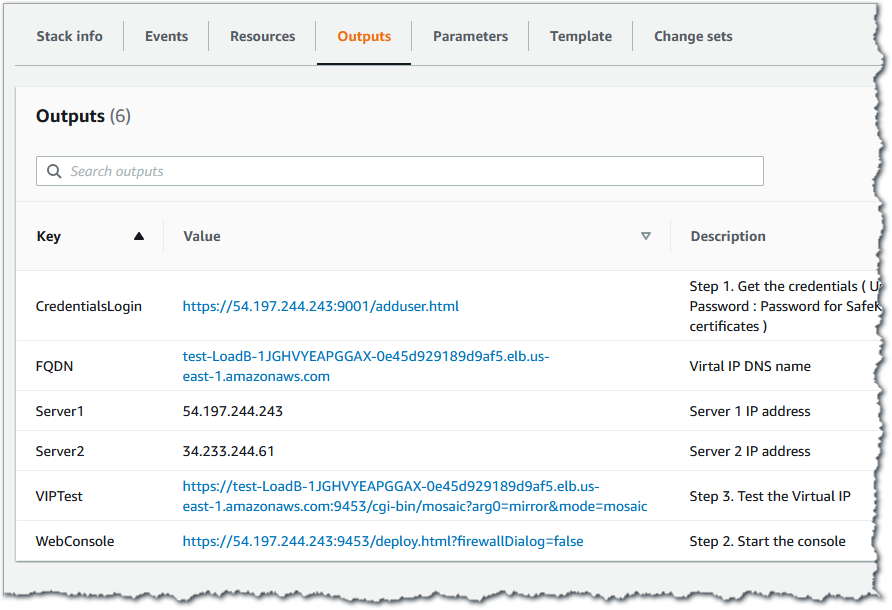

// Add steps as necessary for accessing the software, post-configuration, and testing. Don’t include full usage instructions for your software, but add links to your product documentation for that information.
//Should any sections not be applicable, remove them

== Test the deployment
// If steps are required to test the deployment, add them here. If not, remove the heading
. After deployment, go to the *Outputs* tab, as shown in Figure 5.
+
.SafeKit outputs after successful deployment
[link=images/image5.png]

. Visit the CredentialsLogin URL, and install the client and CA certificates in your web browser.
.. When you access the CredentialsLogin URL, your browser displays a site-not-trusted warning. It does so because the SafeKit certificate hasn’t been added to the “Trusted Root Certification Authority” store on your workstation. The warning message varies depending on which web browser you’re using.
.. If you click the not-secure message in the browser’s URL bar, choose the option to view the certificate. Then, import it to your local certificate store.
.. Save the certificate to the “Trusted Root Certification Authorities” store. See page 180 of the https://www.evidian.com/safekit/docs/cluster-guide.pdf[SafeKit User’s Guide] for step-by-step instructions.
. Start the SafeKit web console.
* *For a mirror module*, test the primary/secondary virtual IP address with the test URL in the template output. A primary/secondary load-balancing rule has been set for external port 9453, internal port 9453. The URL returns the name of the primary server.
* *For a farm module*, test the load-balanced virtual IP address with the test URL in the template output. A load-balancing rule has been set for external port 9453, internal port 9453. A mosaic of server names is displayed according to the server answering to the TCP session.

== Security
// Provide post-deployment best practices for using the technology on AWS, including considerations such as migrating data, backups, ensuring high performance, high availability, etc. Link to software documentation for detailed information.

For security reasons, only users with the necessary permissions can manage SafeKit clusters. For that, SafeKit implements certificates that must be installed in the user’s browser.

== Other useful information
//Provide any other information of interest to users, especially focusing on areas where AWS or cloud usage differs from on-premises usage.

*AWS resources*

* https://aws.amazon.com/getting-started/[Getting Started Resource Center]
* https://docs.aws.amazon.com/general/latest/gr/[AWS General Reference]
* https://docs.aws.amazon.com/general/latest/gr/glos-chap.html[AWS Glossary]

*AWS services*

* https://docs.aws.amazon.com/cloudformation/[AWS CloudFormation]
* https://docs.aws.amazon.com/AWSEC2/latest/UserGuide/AmazonEBS.html[Amazon EBS]
* https://docs.aws.amazon.com/ec2/[Amazon EC2]
* https://docs.aws.amazon.com/iam/[IAM]
* https://docs.aws.amazon.com/vpc/[Amazon VPC]

*SafeKit documentation on the Evidian website*

* https://www.evidian.com/products/high-availability-software-for-application-clustering/aws-high-availability-cluster-synchronous-replication-failover/[Evidian SafeKit mirror cluster]
* https://www.evidian.com/products/high-availability-software-for-application-clustering/aws-load-balancing-cluster-failover/[Evidian SafeKit farm cluster]
* https://www.evidian.com/products/high-availability-software-for-application-clustering/[Evidian SafeKit with modules, demos, customers, training, differentiators]
* https://www.evidian.com/safekit/docs/cluster-guide.htm[Evidian SafeKit User’s Guide]

*Other Quick Start reference deployments*

* https://aws.amazon.com/quickstart/[AWS Quick Start home page]
