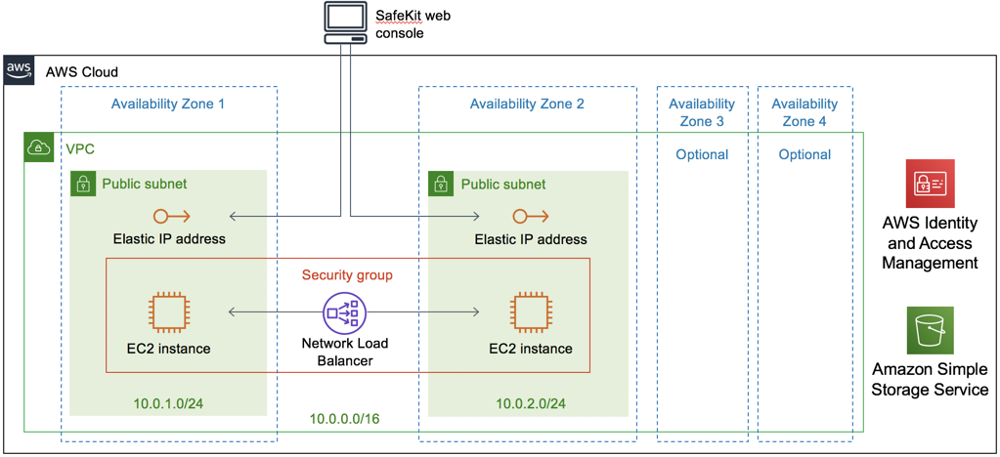

Deploying this Quick Start for a new virtual private cloud (VPC) with
*default parameters* builds the following Evidian SafeKit environment in the
AWS Cloud.

// Replace this example diagram with your own. Send us your source PowerPoint file. Be sure to follow our guidelines here : http://(we should include these points on our contributors giude)
[#architecture1]
.Quick Start architecture for SafeKit mirror on AWS
[link=images/mirror-architecture_diagram.png]
image::../images/mirror-architecture_diagram.png[Architecture,width=648,height=439]

[#architecture2]
.Quick Start architecture for SafeKit farm on AWS
[link=images/farm-architecture_diagram.png]

As shown in Figures 1 and 2, the Quick Start sets up the following:

* A highly available architecture that spans two Availability Zones for the mirror module and up to four for the farm module.
* A VPC configured with public subnets, according to AWS best practices, providing you with your own virtual network on AWS.*
* An AWS Identity and Access Management (IAM) role that accesses the SafeKit Quick Start S3 bucket.

In the public subnets:

* An Elastic IP address that gives access to the SafeKit web console.
* One Amazon Elastic Compute Cloud (EC2) instance for either Linux or Windows.
* A security group that allows inbound Secure Shell (SSH) or Windows Remote Desktop Protocol (RDP) access to the EC2 instances through the public IP addresses. The security group also allows access to the virtual IP port to the Elastic IP addresses.
* A Network Load Balancer that balances traffic between the instances and checks the health of the SafeKit URL.

Figure 1 shows the mirror module:

* Two servers—one primary and one secondary—that run in separate Availability Zones. The critical application runs on the primary server.

Figure 2 shows the farm module:

* One to four servers that run in separate Availability Zones. The critical application runs in all servers in the farm.

*The template that deploys the Quick Start into an existing VPC skips
the components marked by asterisks and prompts you for your existing VPC
configuration.
