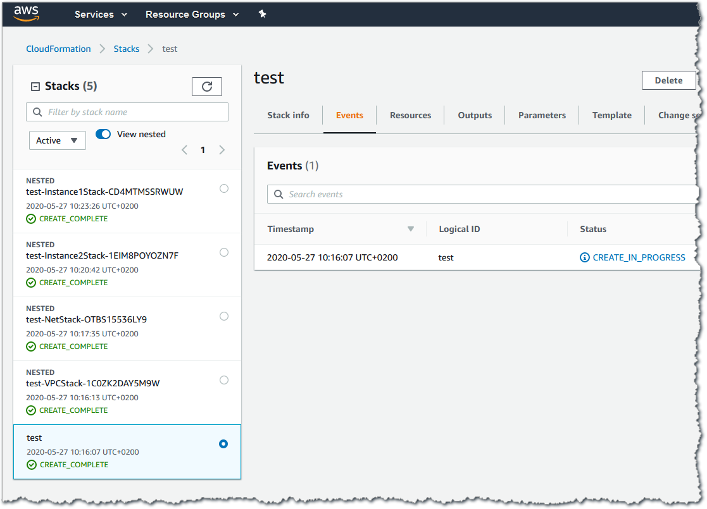
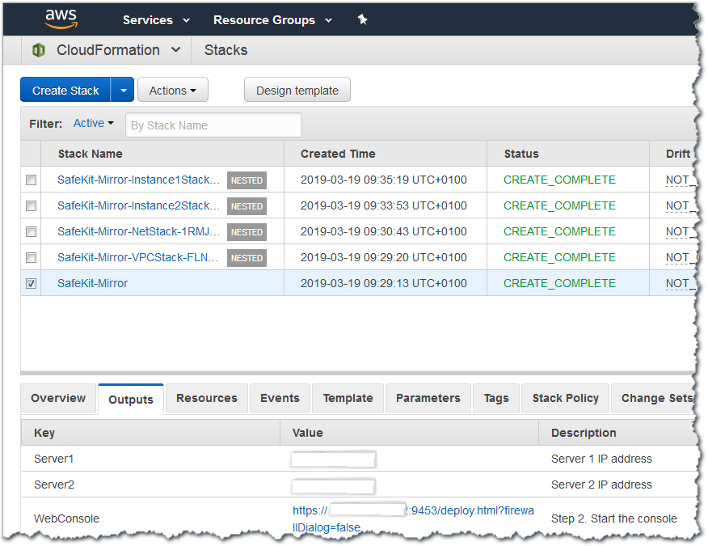

// We need to work around Step numbers here if we are going to potentially exclude the AMI subscription
== Sign in to your AWS account

. Sign in to your AWS account at https://aws.amazon.com with an IAM user role that has the necessary permissions. For details, see link:#planning-the-deployment[Planning the deployment] earlier in this guide.
. Make sure that your AWS account is configured correctly, as discussed in the link:#technical-requirements[Technical requirements] section.

== Launch the Quick Start

NOTE: You are responsible for the cost of the AWS services used while running this Quick Start reference deployment. There is no additional cost for using this Quick Start. For full details, see the pricing pages for each AWS service used by this Quick Start. Prices are subject to change.

. Sign in to your AWS account, and choose one of the following options to launch the AWS CloudFormation template. For help with choosing an option, see link:#_Automated_Deployment[deployment options] earlier in this guide.

[cols=",]
|===
|https://fwd.aws/8VgKN[Deploy Evidian SafeKit mirror into a new VPC on AWS^]
|https://fwd.aws/4wRxE[Deploy Evidian SafeKit farm into a new VPC on AWS^]
|===

Each deployment takes about 30 minutes to complete.

[start=2]
. Check the Region that’s displayed in the upper-right corner of the navigation bar, and change it if necessary. This is where the network infrastructure for SafeKit will be built. The template is launched in the US East (N. Virginia) Region by default.
. On the *Create stack* page, keep the default setting for the template URL, and then choose *Next, two times*.
. On the *Specify stack details* page, set the stack name and review the parameters for the template.
. Provide values for the parameters that require input (Availability Zones, key pair, and certificates password). For all other parameters, review the default settings and customize them as necessary.

// *Note:* This deployment includes Amazon EFS, which isn’t currently supported in all AWS Regions. For a current list of supported Regions, see the https://docs.aws.amazon.com/general/latest/gr/elasticfilesystem.html[endpoints and quotas webpage].

[start=6]
. On the *Create stack* page, keep the default setting for the template URL, and then choose *Next*.
. On the *Specify stack details* page, change the stack name if needed. Review the parameters for the template. Provide values for the parameters that require input. For all other parameters, review the default settings and customize them as necessary.
. On the *Configure stack options* page, you can https://docs.aws.amazon.com/AWSCloudFormation/latest/UserGuide/aws-properties-resource-tags.html[specify tags] (key-value pairs) for resources in your stack and https://docs.aws.amazon.com/AWSCloudFormation/latest/UserGuide/cfn-console-add-tags.html[set advanced options]. When you’re done, choose *Next*.
. On the *Review* page, review and confirm the template settings. Under *Capabilities*, select the two check boxes to acknowledge that the template will create IAM resources and that it might require the ability to automatically expand macros.
. Choose *Create stack* to deploy the stack.
. Monitor the status of the stack. See the *Status* heading shown in Figure 3.
+
.Stack page after successful deployment
[link=images/image3.png]

When the status is *CREATE_COMPLETE*, as shown in Figure 4, the SafeKit cluster is ready. Note that a few nested stacks are created too.

.SafeKit mirror outputs after successful deployment
[link=images/image4.png]

// In the following tables, parameters are listed by category and described separately for the two deployment options:

// * Parameters for deploying {partner-product-name} into a new VPC
// * Parameters for deploying {partner-product-name} into an existing VPC